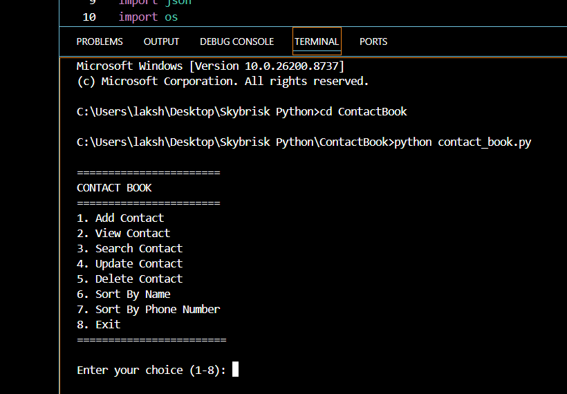
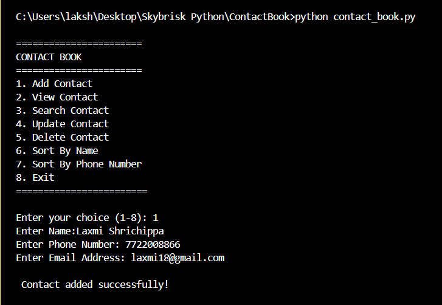
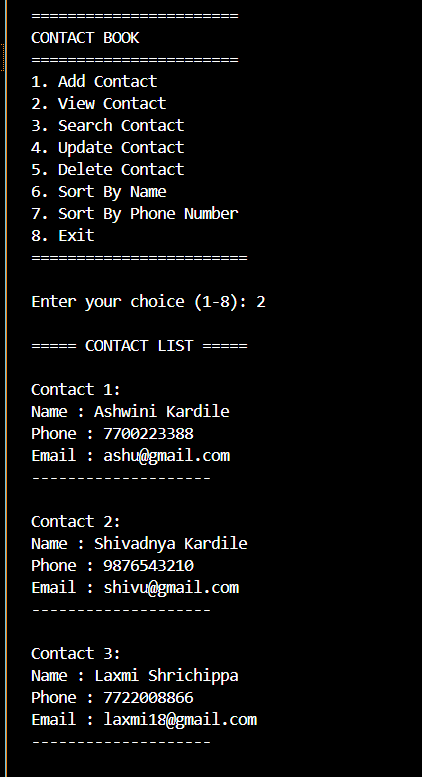
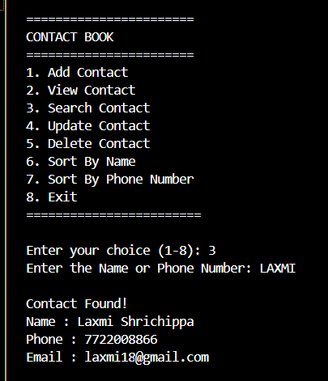
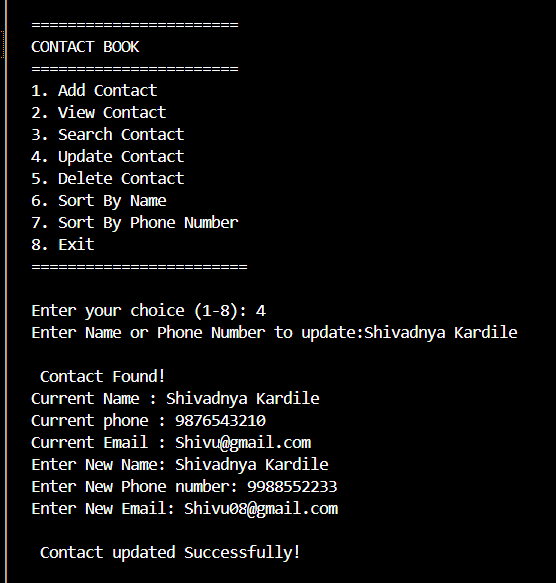
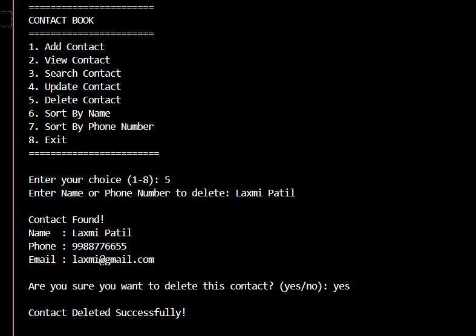
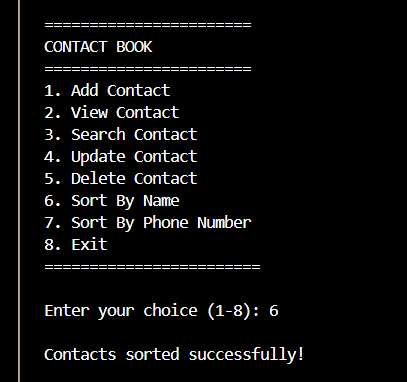
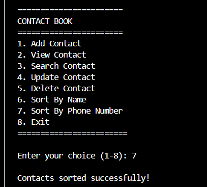
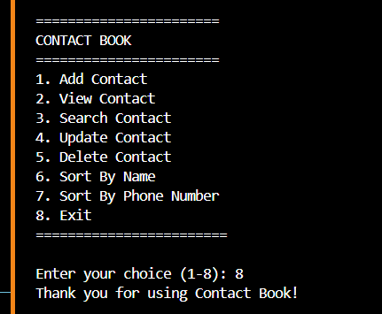

# Command-Line Contact Book Application

## Project Overview

This is a menu-driven Contact Book application developed using Python.

The application allows users to manage contacts using CRUD operations while storing data permanently in a JSON file.

## Features

- Add Contact
- View Contacts
- Search Contact
- Update Contact
- Delete Contact
- Phone Number Validation
- Email Validation
- Duplicate Contact Detection
- Sort Contacts by Name
- Sort Contacts by Phone Number
- JSON File Storage

## Technologies Used

- Python
- JSON
- File Handling

## How to Run

1. Open the project in VS Code.
2. Run:

```bash
python contact_book.py
```

## Project Structure

```
contact_book/
│
├── contact_book.py
├── contact.json
└── README.md
```

## 📸 Application Screenshots

### Main Menu



### Add Contact



### View Contacts



### Search Contact



### Update Contact



### Delete Contact



### Contact Sort By Name 



### Contact Sort By Phone number 



### Contact Exit



## Future Improvements

- Export contacts to CSV
- Import contacts
- GUI using Tkinter
- Database using MySQL
- Password protection